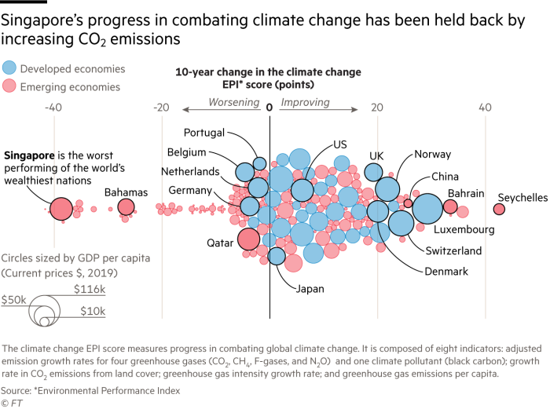

On March 12 2021, [Financial Times](https://www.ft.com/content/a60e9464-a55d-4066-a839-46e334fde094) published an article titled "Singapore fails to keep pace with wealthy peers on carbon emissions" along with the following graphic:


```{r, echo=F, fig.align='center', out.width="60%"}

```

A side note: If you cannot see the full article since you are not subscribed to Financial Times, copy and paste the article title to Google, and click on the one of the suggested links to see full article.

According to the article, 

> The Financial Times has analysed data released by the [Yale Center for Environmental Law & 
> Policy](https://epi.yale.edu/), which recorded individual country performance across 11 categories. On the 
> issue of climate change, the countries were ranked based on their performance between **2008 and 
> 2017**. 
>
> Several indicators are factored into the **Environmental Performance Index score**, with the 
> **largest being the average annual rate of carbon dioxide emissions growth**, which makes up 55 
> per cent of the overall climate change score.      

	
> The majority of **wealthy developed countries** have made significant progress over the 
> 10-year period. The reduction in the reliance on coal as a source of electricity has been 
> the primary contributor to this.

> Singapore, however, has failed to keep pace with the progress of its wealthy peers. The 
> data show that its CO2 emissions growth rate was the third worst of any, after Burundi and 
> Niger.


**Homework Scenario**: Assume that you work as a data scientist at Financial Times and one of your colleagues produced the graphic above. After it goes online, you noticed that the article uses EPI score data from years 2008-2017 and GDP per capita (current prices $) data from 2019 whereas we are in 2021. As a data scientist, you decided that you would like to present recent data to your readers and re-produce the graphic above with 2020 data.

To re-produce the graphic above, you need:

1. EPI score 10-years changes data between 2011-2020 by country, which is available at
https://epi.yale.edu/downloads. Hint: Download the .csv file under "EPI2020 Results" tab into your local computer and "EPI.change" is the column showing the last "10-years changes".
2. GDP per capita (current prices $) data, which is available at https://www.imf.org/external/datamapper/NGDPDPC@WEO/OEMDC/ADVEC/WEOWORLD. Hint: Download the Excel file under "All Data" tab into your local computer and "2020" is the column showing GDP per capita in 2020.
3. Countries classified as "Developing Economies" by IMF is available in `Advanced_Economies.xlsx` under data folder of `HW1 R project`. Hint: The countries which are not in this list can be classified as "Emerging Economies".

Then,

1. Import the data available in these three files into R.
2. For the "180" countries in EPI score data set, create a new data set involving EPI.change, GDP per capita (current prices $), economic status (a binary categorical variable whether the country falls into "Developed Economies" category or "Emerging Economies" category by using the relevant packages in `R`. Hint: At the end, you will have a data frame/tibble of size 180 times 4. **Note: Data sets created out of `R` environment (such as those created manually) will not be accepted.**
3. Create the same graphic given above **as closely as possible** via R ggplot2. Hint: Visit https://www.r-graph-gallery.com/320-the-basis-of-bubble-plot.html.
Note 1: Bubble sizes in the graphic are determined by "GDP per capita", but bubble colors are determined by "economic status" variable. Note 2: Of course, since you are using a different data set, final look of your graphic will not be of the same form as above. 
4. Finally, tell us whether "Singapore is the worst performing of the world's wealthiest nations?" or not.
Note: In the figure Singapore is colored in "pink" indicating that it is an "emerging economic country", which is actually not true. If Singapore is not the worst among the wealthiest countries in this new data set, tell us which one is so. Hint: To give an answer to this, of course, you need to write code.


**Cautionary notes**: 
1) Homework assignments are individual-based studies. For that reason, students are expected to do homework assignments by themselves (**I will also check your commit history to see the evolution of the homework over time**). Homework assignments will not be accepted after deadline. There is **NO** make-up for missed homework.
2) You should download `R Project` on `GitHub` to your local computer, do the changes as needed, delete all the files you have not used to produce your homework, then render the `.Rmd` file to .pdf and finally commit and push all the required files (including `.Rmd` files) by
 April 12, 2021 18:00 via [GitHub Classroom of MAT381E organization](https://github.com/MAT381E).
